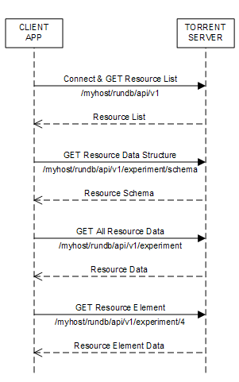

Cookbook - Your First Request and More
======================================

Read this topic for a hands-on introduction to using the REST API. Through a logical progression, using Python examples, you learn the fundamentals of how to make a REST call and how to use the API to access and manipulate a particular data element.

Before you access a resource, you need to get the list of resources exposed by the API, and the mechanism for accessing your particular resource of interest. At each step, you use the API to traverse the relational database or functional component (file or plugin), to obtain your specific data item of interest.

The following diagram shows the request message sequence for to discover a particular data element:

1. Begin with the highest-level request, /myhost/rundb/api/v1, without specifying a resource so all supported resources are returned. The first request sent to the server always requires authentication, which is your username and password.

2. To find the data fields contained by a resource, request the resource schema: /myhost/rundb/api/v1/experiment/schema. You can use these fields to qualify your searches for specific resource elements or data sets.

3. To find all of the resource elements, or objects, send a request that includes only the resource name, or list_endpoint: /myhost/rundb/api/v1/experiment.

4. Once you locate the particular resource element of interest, pass the primary key for the resource, usually the id field, to retrieve only the data for that element: /myhost/rundb/api/v1/experiment/4.

The rest of this document shows how to build on this basic message sequence to refine your searches.

	(!) The interface mechanism demonstrated here is the same for all REST operations, and subsequent more involved examples differ only in particular resource and access request parameters.

.. _Get_resource_list:

Get the list of resources
-------------------------

URIs
^^^^

The REST interface uses a Uniform Resource Identifier (URI) to name and locate a resource. This is the same as an address you commonly type in your browser to retrieve a Web page.

For example:

.. code-block:: none

	http://myhost/rundb/api/v1/experiment

You can see that REST uses the same HTTP protocol as the Web and the rest of the address specifies the location of your resource. This example requests the experiment resource, which is located on the host named myhost in the resource directory /rundb/api/v1, where v1 is the API version.

List available resources
^^^^^^^^^^^^^^^^^^^^^^^^

If you do not already know what the API name for the resource containing your data item is, you need to get a list of resources:

.. code-block:: none

	http://myhost/rundb/api/v1?format=json

This is the basic URI without specifying a resource after the API version.::

	(!) The format=json parameter name:value pair is appended to the request to specify the format, JavaScript Object Notation (JSON), of the returned data. Currently, JSON is the only supported format.

Enter the URI in your browser window or REST client, replacing myhost with your host name. This step also verifies connectivity before continuing with the tutorial. If you are using a REST client and the request is successful, an HTTP status code of 200 is returned. Otherwise, the request failed.

The examples in this tutorial use the Python programming language, because the API is intended to be used programmatically and because Python has both a low barrier to entry and also syntax similar to numerous other commonly used languages.

Also, the examples depend on the json and requests libraries (note that restful_lib is depreciated), so each example assumes the following statements are included:

.. code-block:: python

	import json
	import requests

You can use any equivalent libraries and modify the code snippets as needed.

Now, you can programmatically make the same request for a list of resources using the following code snippet:

.. code-block:: python

	resp = requests.get('http://myhost/rundb/api/v1, auth=('myusername', 'mypassword'))
	resp_json = resp.json()

\

	(!) The examples in this tutorial do not include error handling and assume an HTTP status code of 2xx is always returned.

* On the first API call, it is necessary to connect to the server, providing basepath and authentication parameters. (To run the example, replace myhost with your host name and replace myusername and mypassword with your username and password.)

The connection request returns a connection handle, which is used for subsequent requests.

* The second statement performs a simple GET request, without specifying a resource. The response from the server is returned in the result variable:

.. code-block:: javascript

	{
		"account": {
			"list_endpoint": "/rundb/api/v1/account/", 
			"schema": "/rundb/api/v1/account/schema/"
		}, 
		"activeionchefprepkitinfo": {
			"list_endpoint": "/rundb/api/v1/activeionchefprepkitinfo/", 
			"schema": "/rundb/api/v1/activeionchefprepkitinfo/schema/"
		}, 
		"activelibrarykitinfo": {
			"list_endpoint": "/rundb/api/v1/activelibrarykitinfo/", 
			"schema": "/rundb/api/v1/activelibrarykitinfo/schema/"
		}, 
		"activepgmlibrarykitinfo": {
			"list_endpoint": "/rundb/api/v1/activepgmlibrarykitinfo/",
			"schema": "/rundb/api/v1/activepgmlibrarykitinfo/schema/"
		}, 
		"activepgmsequencingkitinfo": {
			"list_endpoint": "/rundb/api/v1/activepgmsequencingkitinfo/", 
			"schema": "/rundb/api/v1/activepgmsequencingkitinfo/schema/"
		},
		"activeprotonlibrarykitinfo": {
			"list_endpoint": "/rundb/api/v1/activeprotonlibrarykitinfo/", 
			"schema": "/rundb/api/v1/activeprotonlibrarykitinfo/schema/"
		}, 
		"activeprotonsequencingkitinfo": {
			"list_endpoint": "/rundb/api/v1/activeprotonsequencingkitinfo/", 
			"schema": "/rundb/api/v1/activeprotonsequencingkitinfo/schema/"
		}, 
		"activesequencingkitinfo": {
			"list_endpoint": "/rundb/api/v1/activesequencingkitinfo/", 
			"schema": "/rundb/api/v1/activesequencingkitinfo/schema/"
		}, 
		"analysismetrics": {
			"list_endpoint": "/rundb/api/v1/analysismetrics/", 
			"schema": "/rundb/api/v1/analysismetrics/schema/"
		}, 
		"applproduct": {
			"list_endpoint": "/rundb/api/v1/applproduct/", 
			"schema": "/rundb/api/v1/applproduct/schema/"
		}, 
		"availableionchefplannedexperiment": {
			"list_endpoint": "/rundb/api/v1/availableionchefplannedexperiment/", 
			"schema": "/rundb/api/v1/availableionchefplannedexperiment/schema/"
		}, 
		"availableionchefplannedexperimentsummary": {
			"list_endpoint": "/rundb/api/v1/availableionchefplannedexperimentsummary/", 
			"schema": "/rundb/api/v1/availableionchefplannedexperimentsummary/schema/"
		}, 
		"availableonetouchplannedexperiment": {
			"list_endpoint": "/rundb/api/v1/availableonetouchplannedexperiment/", 
			"schema": "/rundb/api/v1/availableonetouchplannedexperiment/schema/"
		}, 
		"availableonetouchplannedexperimentsummary": {	
			"list_endpoint": "/rundb/api/v1/availableonetouchplannedexperimentsummary/",
			"schema": "/rundb/api/v1/availableonetouchplannedexperimentsummary/schema/"
		},
		"availableplannedexperimentsummary": {
			"list_endpoint": "/rundb/api/v1/availableplannedexperimentsummary/", 
			"schema": "/rundb/api/v1/availableplannedexperimentsummary/schema/"
		}, 
		"chip": {
			"list_endpoint": "/rundb/api/v1/chip/", 
			"schema": "/rundb/api/v1/chip/schema/"
		}, 
		"compositedatamanagement": {
			"list_endpoint": "/rundb/api/v1/compositedatamanagement/", 
			"schema": "/rundb/api/v1/compositedatamanagement/schema/"
		}, 
		"compositeexperiment": {
			"list_endpoint": "/rundb/api/v1/compositeexperiment/", 
			"schema": "/rundb/api/v1/compositeexperiment/schema/"
		}, 
		"compositeresult": {
			"list_endpoint": "/rundb/api/v1/compositeresult/", 
			"schema": "/rundb/api/v1/compositeresult/schema/"
		}, 
		"content": {
			"list_endpoint": "/rundb/api/v1/content/", 
			"schema": "/rundb/api/v1/content/schema/"
		}, 
		"contentupload": {
			"list_endpoint": "/rundb/api/v1/contentupload/", 
			"schema": "/rundb/api/v1/contentupload/schema/"
		}, 
		"datamanagementhistory": {
			"list_endpoint": "/rundb/api/v1/datamanagementhistory/", 
			"schema": "/rundb/api/v1/datamanagementhistory/schema/"
		}, 
		"dnabarcode": {
			"list_endpoint": "/rundb/api/v1/dnabarcode/", 
			"schema": "/rundb/api/v1/dnabarcode/schema/"
		}, 
		"emailaddress": {
			"list_endpoint": "/rundb/api/v1/emailaddress/", 
			"schema": "/rundb/api/v1/emailaddress/schema/"
		}, 
		"eventlog": {
			"list_endpoint": "/rundb/api/v1/eventlog/", 
			"schema": "/rundb/api/v1/eventlog/schema/"
		}, 
		"experiment": {
			"list_endpoint": "/rundb/api/v1/experiment/", 
			"schema": "/rundb/api/v1/experiment/schema/"
		}, 
		"experimentanalysissettings": {
			"list_endpoint": "/rundb/api/v1/experimentanalysissettings/", 
			"schema": "/rundb/api/v1/experimentanalysissettings/schema/"
		}, 
		"fileserver": {
			"list_endpoint": "/rundb/api/v1/fileserver/", 
			"schema": "/rundb/api/v1/fileserver/schema/"
		}, 
		"globalconfig": {
			"list_endpoint": "/rundb/api/v1/globalconfig/", 
			"schema": "/rundb/api/v1/globalconfig/schema/"
		}, 
		"ionchefplantemplate": {
			"list_endpoint": "/rundb/api/v1/ionchefplantemplate/", 
			"schema": "/rundb/api/v1/ionchefplantemplate/schema/"
		}, 
		"ionchefplantemplatesummary":{
			"list_endpoint": "/rundb/api/v1/ionchefplantemplatesummary/", 
			"schema": "/rundb/api/v1/ionchefplantemplatesummary/schema/"
		}, 
		"ionchefprepkitinfo": {
			"list_endpoint": "/rundb/api/v1/ionchefprepkitinfo/", 
			"schema": "/rundb/api/v1/ionchefprepkitinfo/schema/"
		}, 
		"ionreporter": {
			"list_endpoint": "/rundb/api/v1/ionreporter/", 
			"schema": "/rundb/api/v1/ionreporter/schema/"
		}, "kitinfo": {
			"list_endpoint": "/rundb/api/v1/kitinfo/", 
			"schema": "/rundb/api/v1/kitinfo/schema/"
		}, 
		"kitpart": {
			"list_endpoint": "/rundb/api/v1/kitpart/", 
			"schema": "/rundb/api/v1/kitpart/schema/"
		}, 
		"libmetrics": {
			"list_endpoint": "/rundb/api/v1/libmetrics/", 
			"schema": "/rundb/api/v1/libmetrics/schema/"
		}, 
		"librarykey": {
			"list_endpoint": "/rundb/api/v1/librarykey/", 
			"schema": "/rundb/api/v1/librarykey/schema/"
		}, 
		"librarykitinfo": {
			"list_endpoint": "/rundb/api/v1/librarykitinfo/", 
			"schema": "/rundb/api/v1/librarykitinfo/schema/"
		}, 
		"librarykitpart": {
			"list_endpoint": "/rundb/api/v1/librarykitpart/", 
			"schema": "/rundb/api/v1/librarykitpart/schema/"
		}, 
		"location": {
			"list_endpoint": "/rundb/api/v1/location/", 
			"schema": "/rundb/api/v1/location/schema/"
		}, 
		"log": {
			"list_endpoint": "/rundb/api/v1/log/", 
			"schema": "/rundb/api/v1/log/schema/"
		}, 
		"message": {
			"list_endpoint": "/rundb/api/v1/message/", 
			"schema": "/rundb/api/v1/message/schema/"
		}, 
		"monitorexperiment": {
			"list_endpoint": "/rundb/api/v1/monitorexperiment/", 
			"schema": "/rundb/api/v1/monitorexperiment/schema/"
		}, 
		"obsoletereferencegenome": {
			"list_endpoint": "/rundb/api/v1/obsoletereferencegenome/", 
			"schema": "/rundb/api/v1/obsoletereferencegenome/schema/"
		}, 
		"onetouchplantemplate": {
			"list_endpoint": "/rundb/api/v1/onetouchplantemplate/",
			"schema": "/rundb/api/v1/onetouchplantemplate/schema/"
		}, 
		"onetouchplantemplatesummary": {
			"list_endpoint": "/rundb/api/v1/onetouchplantemplatesummary/", 
			"schema": "/rundb/api/v1/onetouchplantemplatesummary/schema/"
		}, 
		"plannedexperiment": {
			"list_endpoint": "/rundb/api/v1/plannedexperiment/", 
			"schema": "/rundb/api/v1/plannedexperiment/schema/"
		}, 
		"plannedexperimentdb": {
			"list_endpoint": "/rundb/api/v1/plannedexperimentdb/", 
			"schema": "/rundb/api/v1/plannedexperimentdb/schema/"
		}, 
		"plannedexperimentqc": {
			"list_endpoint": "/rundb/api/v1/plannedexperimentqc/", 
			"schema": "/rundb/api/v1/plannedexperimentqc/schema/"
		}, 
		"plantemplatesummary": {
			"list_endpoint": "/rundb/api/v1/plantemplatesummary/", 
			"schema": "/rundb/api/v1/plantemplatesummary/schema/"
		}, 
		"plugin": {
			"list_endpoint": "/rundb/api/v1/plugin/",
			"schema": "/rundb/api/v1/plugin/schema/"
		}, 
		"pluginresult": {
			"list_endpoint": "/rundb/api/v1/pluginresult/", 
			"schema": "/rundb/api/v1/pluginresult/schema/"
		}, 
		"project": {
			"list_endpoint": "/rundb/api/v1/project/", 
			"schema": "/rundb/api/v1/project/schema/"
		}, 
		"publisher": {
			"list_endpoint": "/rundb/api/v1/publisher/", 
			"schema": "/rundb/api/v1/publisher/schema/"
		}, 
		"qctype": {
			"list_endpoint": "/rundb/api/v1/qctype/", 
			"schema": "/rundb/api/v1/qctype/schema/"
		}, 
		"qualitymetrics": {
			"list_endpoint": "/rundb/api/v1/qualitymetrics/", 
			"schema": "/rundb/api/v1/qualitymetrics/schema/"
		}, 
		"referencegenome": {
			"list_endpoint": "/rundb/api/v1/referencegenome/", 
			"schema": "/rundb/api/v1/referencegenome/schema/"
		}, 
		"results": {
			"list_endpoint": "/rundb/api/v1/results/", 
			"schema": "/rundb/api/v1/results/schema/"
		}, 
		"rig": {
			"list_endpoint": "/rundb/api/v1/rig/", 
			"schema": "/rundb/api/v1/rig/schema/"
		}, 
		"runtype": {
			"list_endpoint": "/rundb/api/v1/runtype/", 
			"schema": "/rundb/api/v1/runtype/schema/"
		}, 
		"sample": {
			"list_endpoint": "/rundb/api/v1/sample/", 
			"schema": "/rundb/api/v1/sample/schema/"
		}, 
		"sequencingkitinfo": {
			"list_endpoint": "/rundb/api/v1/sequencingkitinfo/", 
			"schema": "/rundb/api/v1/sequencingkitinfo/schema/"
		}, 
		"sequencingkitpart": {
			"list_endpoint": "/rundb/api/v1/sequencingkitpart/",
			"schema": "/rundb/api/v1/sequencingkitpart/schema/"
		}, 
		"template": {
			"list_endpoint": "/rundb/api/v1/template/", 
			"schema": "/rundb/api/v1/template/schema/"
		}, 
		"tfmetrics": {
			"list_endpoint": "/rundb/api/v1/tfmetrics/", 
			"schema": "/rundb/api/v1/tfmetrics/schema/"
		}, 
		"threeprimeadapter": {
			"list_endpoint": "/rundb/api/v1/threeprimeadapter/", 
			"schema": "/rundb/api/v1/threeprimeadapter/schema/"
		}, 
		"torrentsuite": {
			"list_endpoint": "/rundb/api/v1/torrentsuite/", 
			"schema": "/rundb/api/v1/torrentsuite/schema/"
		}, 
		"user": {
			"list_endpoint": "/rundb/api/v1/user/", 
			"schema": "/rundb/api/v1/user/schema/"
		}
	}

You now have a listing of all resources available through the REST API. Notice that each resource is described by a list_endpoint and a schema, which are partial URIs. Use these URIs in subsequent calls to read and write resource data.

.. _Get_resource_structure:

Get the resource data structure
-------------------------------

Use the schema URI to get the resource data structure, which limits the names and fields of all resource data elements.

Example:

.. code-block:: none

	http://myhost/rundb/api/v1/experiment/schema?format=json

.. _Get_experiment_list:

Get a list of experiments
-------------------------

This section shows how to get the experiment resource data. This example uses the experiment resource, but the experiment field in the URI could be replaced by any resource name.

	(!) By default, a maximum of 20 resource objects are returned. Add the limit parameter, as shown, to return all objects for a resource (for some resources, this may result in a large amount of data):

This request uses the experiment ``list_endpoint`` URI and has the following general form:
	
.. code-block:: none

	http://myhost/rundb/api/v1/experiment?format=json&limit=0

These steps show how to get  experiment resource data programmatically:

1. Connect to the resource.

2. Post a request for data using the GET method.

.. code-block:: python

	base_url = 'http://myhost/rundb/api/v1'
	resp = requests.get('%s/experiment/?format=json'%base_url, auth=('myusername', 'mypassword'))
	resp_json = resp.json()

In the code snippet, a base_url variable is used to define the part of the URI that is common for all requests. For the experiment resource, the following example data are returned:

.. code-block:: javascript

	{
	    "meta": {
		"limit": 20,
		"next": null,
		"offset": 0,
		"previous": null,
		"total_count": 1
	    },
	    "objects": [
		{
			"autoAnalyze": true, 
			"baselineRun": false, 
			"chipBarcode": "", 
			"chipType": "318", 
			"cycles": 0, 
			"date": "2013-02-08T21:00:52.000449+00:00", 
			"diskusage": 0, 
			"displayName": "5c2f8551-ac03-4c99-a9a7-83a5c0b41842", 
			"eas_set": [
				{
					"barcodeKitName": "", 
					"barcodedSamples": {}, 
					"date": "2012-12-15T00:53:29.000428+00:00", 
					"experiment": "/rundb/api/v1/experiment/7/", 
					"hotSpotRegionBedFile": "", 
					"id": 3, 
					"isDuplicateReads": false, 
					"isEditable": true, 
					"isOneTimeOverride": false, 
					"libraryKey": "TCAG", 
					"libraryKitBarcode": null, 
					"libraryKitName": "Ion Xpress Plus Fragment Library Kit", 
					"reference": "", 
					"resource_uri": "/rundb/api/v1/experimentanalysissettings/3/", 
					"results": [
						"/rundb/api/v1/results/55/", 
						"/rundb/api/v1/results/26/"
					], 
					"selectedPlugins": {
						"IonReporterUploader": {"features": ["export"], "id": 167, "name": "IonReporterUploader", "userInput": [{"Workflow": ""}], "version": "3.6.0-r58488"}, 
						"SFFCreator": {"features": [], "id": 157, "name": "SFFCreator", "version": "3.4.48481"}, 
						"variantCaller": {"features": [], "id": 165, "name": "variantCaller", "userInput": {"librarytype": "targetseq", "variationtype": ""}, "version": "3.4.48983"}}, 
					"status": "planned", 
					"targetRegionBedFile": "", 
					"threePrimeAdapter": "ATCACCGACTGCCCATAGAGAGGCTGAGAC"
				}
			], 
			"expCompInfo": "", 
			"expDir": "", 
			"expName": "5c2f8551-ac03-4c99-a9a7-83a5c0b41842", 
			"flows": 500, 
			"flowsInOrder": "", 
			"ftpStatus": "Complete", 
			"id": 7, 
			"isReverseRun": false, 
			"log": { ... }, 
			"metaData": {}, 
			"notes": "", 
			"pgmName": "", 
			"plan": "/rundb/api/v1/plannedexperiment/41/", 
			"rawdatastyle": "single", 
			"reagentBarcode": "", 
			"resource_uri": "/rundb/api/v1/experiment/7/", 
			"resultDate": "2013-02-08T21:00:52.000450+00:00", 
			"results": [], 
			"reverse_primer": null, 
			"runMode": "single", 
			"runtype": "GENS", 
			"sample": "Example_2", 
			"samples": [
				{"date": "2012-12-15T00:53:29.000428+00:00", 
				"description": null, 
				"displayedName": "Example_2", 
				"experiments": ["/rundb/api/v1/experiment/7/"], 
				"externalId": null, 
				"id": 2, 
				"name": "Example_2", 
				"resource_uri": "/rundb/api/v1/sample/2/", 
				"status": "planned"}
			], 
			"seqKitBarcode": "", 
			"sequencekitbarcode": "", 
			"sequencekitname": "IonPGM200Kit", 
			"star": false, 
			"status": "planned", 
			"storageHost": null, 
			"storage_options": "A", 
			"unique": "5c2f8551-ac03-4c99-a9a7-83a5c0b41842", 
			"usePreBeadfind": false, 
			"user_ack": "U"
		} ]
	}

``meta`` field
^^^^^^^^^^^^^^

The ``meta`` field contains data about the object data. The metadata of interest for the experiment resource is that the resource currently contains 1 experiment.

``object`` field
^^^^^^^^^^^^^^^^

The ``object`` field is a list containing actual experiment data, or properties. Two elements are listed, which is also indicated by the metadata ``total_count`` field.

Refer to the database schema for a description of each data item.

Notice that the results data item is another URI list, containing the locations of results data for the experiment.

.. _Get_specific_experiment:

Get data for a specific experiment
----------------------------------

You can get the data for a specific experiment by specifying the experiment resource primary key value in the URI, for the desired experiment. For most resources, the primary key is the id field. The exception is the rig resource, which has the name field as the primary key.

A request for the experiment whose id field is 4 has the following form:

General form
^^^^^^^^^^^^^

.. code-block:: none

	http://myhost/rundb/api/v1/experiment/4?format=json

Python snippet
^^^^^^^^^^^^^^

.. code-block:: python

	base_url = 'http://myhost/rundb/api/v1'
	resp = requests.get('%s/experiment/4?format=json'%base_url, auth=('myusername', 'mypassword'))
	resp_json = resp.json()

The response includes the data for the single experiment whose id is 4. The output is similar to the output shown in :ref:`Get_experiment_list`.

Alternate method
^^^^^^^^^^^^^^^^

Using the primary key, you can request data simply by encoding the key value in the main part of the URI (as seen in the previous examples). If instead only one of the field properties of a resource is known, you can use an alternative method of requesting a particular resource element by passing a filtering parameter in the request.

In the following example, instead of specifying a primary key value, the experiment name field, expName, is passed as a parameter to get the same experiment resource element:

General form
^^^^^^^^^^^^^

.. code-block:: none

	http://myhost/rundb/api/v1/experiment?format=json&expName=5c2f8551-ac03-4c99-a9a7-83a5c0b41842

Python snippet
^^^^^^^^^^^^^^

.. code-block:: python

	base_url = 'http://myhost/rundb/api/v1'
	resp = requests.get('%s/experiment?format=json&expName=5c2f8551-ac03-4c99-a9a7-83a5c0b4184'%base_url, auth=('myusername', 'mypassword')
	resp_json = resp.json()

Try both of these requests to verify that the same experiment data are returned.

.. _Next:

Next
----

This section assumed that no errors occurred in the request-response transaction between your application and the server. In the next section, you learn about the kinds of errors that can occur as you develop more complex applications.

This section finished with a brief mention of filtering as a way of selecting a particular resource element. Following sections show the flexibility provided by filtering in selecting single or groups of resource elements.

Building on selecting the desired resource elements returned by the server, you also learn how to order, or sort, results.

