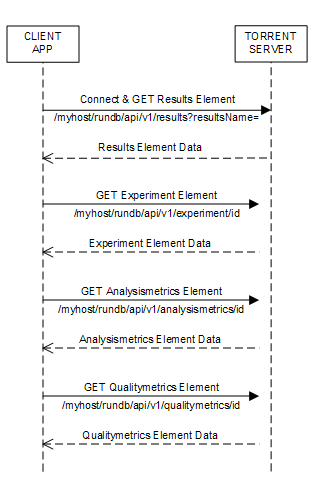

Get Run Metadata and Metrics
============================

This section describes a more involved programming example that begins to approach an actual application. From the previous sections, you gained the basic knowledge needed to begin to write simple applications.

This example gets basic information about a particular run by requesting the results resource element for the run. To demonstrate getting data using links, the run gets experiment data and metrics by traversing results links to the experiment, analysismetrics and qualitymetrics resources. The program outputs experiment metadata and run metrics.

Use the following command to run the program in your Python environment:

.. code-block:: none

	getruninfo.py <runName>
	
Example: ``getruninfo.py Auto_B6--237_3``

The following sequence diagram shows the request-response flow:

The program
-----------

	(!) You can view the full source code at `Torrent Suite API Source Code Samples <../manual_code_examples_index.html>`_.

The example uses the Python libraries requests to make REST requests to the server and simplejson to parse JSON data into Python objects. You can modify the program as needed for your libraries.

.. code-block:: python

	import requests
	import simplejson as json
	import sys

Handle the command line and save the run name input parameter. The run name is used in formatting the request to the server to return results for the particular run.

.. code-block:: python

	if len(sys.argv) == 2:
		[runName] = sys.argv[1:2]
	else:
		print '\n\tUsage:   getruninfo.py <runName>'
		print '\n\tExample: getruninfo.py Auto_user_f4--134-br_21'
		sys.exit(1)

Connect to the server on sending the first request and GET the results element associated with the desired run name.

The requests KeyError and IndexError exceptions are also handled.

.. code-block:: python

	base_url = 'http://myhost/rundb/api/v1'
	resp = requests.get('%s/results?format=json&resultsName=%s'%(base_url, runName), auth=('myusername', 'mypassword'))
	resp_json = resp.json()
	
	try:
		runData = resp_json[u'objects'][0]
		experLoc = runData[u'experiment']
	except (KeyError, IndexError):
		print 'ERROR: Invalid name given.'
		sys.exit(1)

Connect to the server on sending the first request and GET the results element associated with the desired run name.

Decode the JSON data received from the server into Python objects.

The objects field contains the run data. Of these data, the following fields are of interest for output display or for linking to additional data:

	* resultsName
	* timeStamp
	* experiment
	* analysismetrics
	* qualitymetrics

Use the experiment field to get the URI of the experiment data associated with this run, and parse the JSON response data.

Display the experiment metadata from the following experiment element fields:

	* project
	* expName
	* pgmName
	* library
	* notes

The dictionary KeyError exception is also handled.

.. code-block:: python

	expResult = requests.get('http://%s%s'%(myhost, experLoc))
	expData = expResult.json()
	
	try:
		print '\nProject:\t\t%s'%expData[u'log'][u'project']
		print 'Experiment Name:\t%s'%expData[u'expName']
		print 'PGM Name:\t\t%s'%expData[u'pgmName']
		print 'Library:\t\t%s'%expData[u'log'][u'library']
		print 'Notes:\t\t\t%s'%expData[u'notes']
	except KeyError:
		print 'ERROR: Invalid key in expData.'

Display the results element data previously parsed.

.. code-block:: python

	try:
		print 'Results:\t\t%s'%runData['resultsName']
		print 'Timestamp:\t\t%s'%runData['timeStamp']
	except KeyError:
		print 'ERROR: Invalid key in runData.'

Similar to the way you retrieved experiment data, use the analysismetrics and qualitymetrics fields to get the respective URIs for retrieving metrics data from the server. Parse the JSON response data for both elements and display the results. All returned metrics data are displayed.

.. code-block:: python

	ametricsLoc = runData[u'analysismetrics'][0]
	aResult = requests.get('http://%s%s'%(myhost,ametricsLoc))
	aData = aResult.json()
	
	print '\n\nAnalysis Metrics:\n==================\n'
	for propType, propVal in aData.iteritems():
		if propType != 'resource_uri':
			print '%s\t\t= %s'%(propType, propVal)
	
	qmetricsLoc = runData[u'qualitymetrics'][0]
	qResult = requests.get('http://%s%s'%(myhost,qmetricsLoc))
	qData = qResult.json()
	
	print '\n\nQuality Metrics:\n===================\n'
	for propType, propVal in qData.iteritems():
		if propType != 'resource_uri':
			print '%s\t\t=%s'%(propType, propVal)

.. _The_output:

The output
----------

Run on a sample database, the program described above produces the following output. You should get similar results running the program against your database.

.. code-block:: none

	Project:                test
	Experiment Name:        R_2012_12_05_19_34_18_user_F4--134-br
	PGM Name:               f4
	Library:                hg19
	Notes:					
	Results:                barcode_test_large
	Timestamp:              2013-06-06T15:28:15.000486+00:00
	
	
	Analysis Metrics:
	==================
	
	libLive         = 0
	ignored         = 30065
	washout_ambiguous               = 0
	sysIE           = 0.600278610364
	bead            = 736200
	tfKp            = 0
	washout_live            = 0
	id              = 15
	libFinal                = 452234
	lib             = 720367
	keypass_all_beads               = 0
	dud             = 15616
	sysCF           = 0.877433363348
	pinned          = 56051
	live            = 720584
	excluded                = 0
	tf              = 217
	empty           = 137684
	tfFinal         = 200
	amb             = 0
	lib_pass_basecaller             = 0
	lib_pass_cafie          = 0
	washout_dud             = 0
	libMix          = 0
	report          = /rundb/api/v1/results/17/
	libKp           = 0
	tfLive          = 0
	sysDR           = 0.0382701400667
	washout_test_fragment           = 0
	washout_library         = 0
	washout         = 0
	tfMix           = 0
	
	
	Quality Metrics:
	===================
	
	q0_reads                =451883
	q17_max_read_length             =173
	q20_reads               =451883
	report          =/rundb/api/v1/results/17/
	q17_mean_read_length            =87.0
	q17_100bp_reads         =263410
	q0_max_read_length              =181
	q20_100bp_reads         =105246
	id              =15
	q20_mean_read_length            =49
	q17_bases               =39133239
	q0_bases                =47709033
	q20_150bp_reads         =6
	q17_reads               =451883
	q17_50bp_reads          =346855
	q20_50bp_reads          =198227
	q0_50bp_reads           =414922
	q17_150bp_reads         =89
	q0_150bp_reads          =298
	q0_mean_read_length             =105.0
	q20_max_read_length             =156.0
	q0_100bp_reads          =333009
	q20_bases               =35345630
